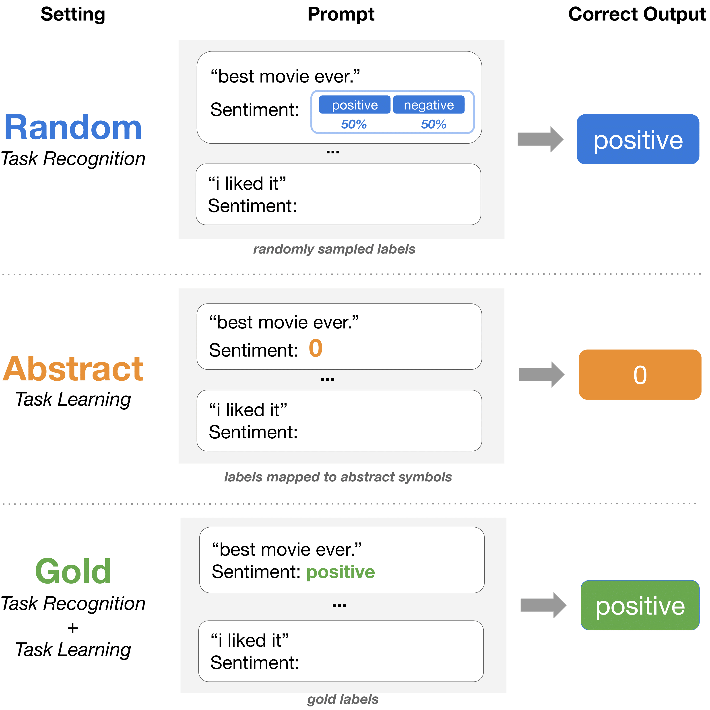

# What In-Context Learning “Learns” In-Context: Disentangling Task Recognition and Task Learning

This repository contains the code for our paper ["What In-Context Learning “Learns” In-Context: Disentangling Task Recognition and Task Learning"](https://arxiv.org/abs/2305.09731) (Findings of ACL 2023).

# Overview
<!--  -->
<p align="center">
  
</p>


In this work, we present a suite of experiments designed to disentangle two driving forces behind in-context learning (ICL). Task recognition captures the extent to which LLMs can recognize a task through demonstrations -- even without ground-truth labels~-- and apply their pre-trained priors, whereas task learning is the ability to capture new input-label mappings unseen in pre-training.

We test under three settings: Gold, Abstract, and Random. Gold labels preserve the ground-truth input-label mapping. Abstract labels use a randomly generated mapping to replace the original labels with an abstract symbol (e.g. numbers or letters). Random labels are randomized by sampling uniformly at random from the natural language label space.

# Requirements
First, install all dependencies:

```
pip install -r requirements.txt
```

Please note that there may be variation due to different versions of packages, but the trends described in our paper should remain consistent.

# Using the codebase
You can see some sample scripts in the subfolder `scripts`. The script `test.sh` inputs key parameters (e.g. label type, dataset, model), etc. to `run_label_tests.sh`, which calls `main.py`.

 
# Contact
Please email Jane (jp7224@cs.princeton.edu) with any questions or open a Github issue to report bugs.

# Citation
If you found our paper or code useful, you can cite our work:

```bibtex
@inproceedings{pan2023what,
   title={What In-Context Learning 'Learns' In-Context: Disentangling Task Recognition and Task Learning},
   author={Pan, Jane and Gao, Tianyu and Chen, Howard and Chen, Danqi},
   booktitle={Findings of Association for Computational Linguistics (ACL)},
   year={2023}
}
```
